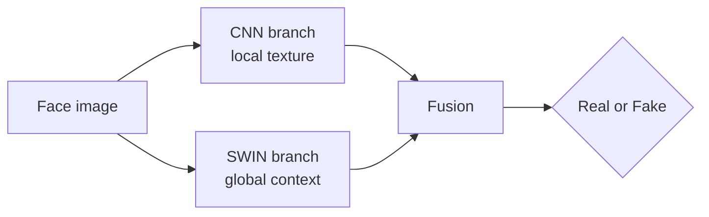

<h1 align="center">Hybrid Deepfake Detection</h1>

  <b>Combining Vision Transformers and CNNs to tell real faces from fake ones</b>

  
  
  
  

---

CNNs are good at spotting local texture artifacts. Transformers are good at global context. Deepfakes leave traces at both scales, so this project pairs the **SWIN Transformer** with several CNN and vision-language backbones and fuses what each one sees.

Every hybrid beat its standalone counterpart. The best model reached **93.47% accuracy and 93.01% F1**.

## Approach

## Results

| Hybrid model | Accuracy (%) | F1 (%) | Gain over its standalone backbone |
| --- | --- | --- | --- |
| **ConvNeXt-SWIN** | **93.47** | **93.01** | +1.48% accuracy |
| MobileNet-SWIN | 92.28 | 92.71 | +0.38% accuracy |
| DenseNet-SWIN | 91.36 | 90.75 | +3.48% accuracy |
| CLIP-SWIN | 91.11 | 90.84 | +9.47% accuracy |

Trained and evaluated on a combined set drawn from FaceForensics++, Celeb-DF (v2), DFDC and 140k Real and Fake Faces. No data is stored in this repo.

## Notebooks

| Notebook | Model |
| --- | --- |
| `convnext-swin-hybrid-model.ipynb` | ConvNeXt-SWIN hybrid (best overall) |
| `clip-swin-hybrid-model.ipynb` | CLIP-SWIN hybrid |
| `densenet-swin-hybrid-model.ipynb` | DenseNet-SWIN hybrid |
| `mobilenet-hybrid-and-standalone.ipynb` | MobileNet-SWIN hybrid and standalone baseline |
| `swin-standalone-model.ipynb` · `convnext-standalone-model.ipynb` · `densenet-standalone-model.ipynb` · `clip-standalone-model.ipynb` | Standalone baselines |

## Team

Ishaan Mishra, Jyotiska Bose, Jada Viswa Chaitanya Sai, Adnan Hasan, Jai Kumar and Kaif Akhter, supervised by Dr. Soumya Ranjan Mishra, KIIT University, Bhubaneswar.

The paper describing this work is in preparation and available on request.
