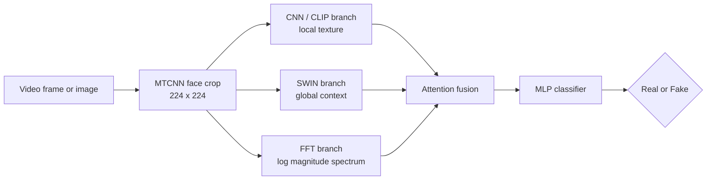

<h1 align="center">Hybrid Deepfake Detection</h1>

  <b>Combining Vision Transformers and CNNs to tell real faces from fake ones</b>

  
  
  
  
  

---

CNNs are good at spotting local texture artifacts: odd skin, broken edges, lighting that doesn't add up. Transformers are good at global context: whether the face hangs together as a whole. Deepfakes leave traces at both scales, so this project pairs the **SWIN Transformer** with four different backbones (**ConvNeXt, DenseNet, MobileNetV3 and CLIP**). It adds an **FFT frequency branch** that looks for spectral artifacts left by generators, and **attention fusion** that learns how much to trust each branch per image.

Every hybrid beat its standalone counterpart. The best model, **ConvNeXt-SWIN**, reached **93.47% accuracy, 93.01% F1 and 0.9831 AUC-ROC**.

## Architecture

| Branch | What it looks for |
| --- | --- |
| **CNN / CLIP** | Micro-artifacts in skin texture, lighting, shadows and edges (CLIP adds semantic consistency between face and background) |
| **SWIN Transformer** | Long-range dependencies and global facial structure via shifted-window self-attention |
| **Frequency (FFT)** | Spectral artifacts from generation, using `log(|F(x)| + 1)` passed through a lightweight CNN |
| **Attention fusion** | Learns each branch's weight per input before classification |

The MobileNet-SWIN hybrid drops the frequency branch to stay light for resource-constrained deployment.

## Results

Test-set metrics for every model, standalone and hybrid:

| Model | Test Loss | Accuracy (%) | Precision (%) | Recall (%) | F1 (%) | AUC-ROC |
| --- | --- | --- | --- | --- | --- | --- |
| Swin Transformer | 0.3803 | 89.91 | 88.28 | 90.24 | 89.25 | 0.9667 |
| CLIP | 0.3988 | 81.64 | 77.62 | 84.95 | 81.12 | 0.9015 |
| **CLIP-SWIN Hybrid** | 0.2355 | 91.11 | 87.04 | **94.99** | 90.84 | 0.9741 |
| DenseNet | 0.2725 | 87.88 | 91.75 | 81.21 | 86.16 | 0.9588 |
| **DenseNet-SWIN Hybrid** | 0.2245 | 91.36 | 90.21 | 91.30 | 90.75 | 0.9737 |
| ConvNeXt | 0.2456 | 91.99 | 93.11 | 89.37 | 91.11 | 0.9798 |
| **ConvNeXt-SWIN Hybrid** | **0.2100** | **93.47** | 92.47 | 93.55 | **93.01** | **0.9831** |
| MobileNet | 0.3511 | 91.90 | 93.79 | 90.89 | 92.32 | 0.9747 |
| **MobileNet-SWIN Hybrid** | 0.3438 | 92.28 | **93.82** | 91.63 | 92.71 | 0.9786 |

**Takeaways**
- **Best overall:** ConvNeXt-SWIN, top in accuracy, F1 and AUC-ROC.
- **Best recall:** CLIP-SWIN at 94.99%, for cases where missing a fake costs more than a false alarm.
- **Best for low-resource use:** MobileNet-SWIN, at 92.28% accuracy with a lightweight backbone.
- **Biggest gain from hybridisation:** CLIP-SWIN beats standalone CLIP by +9.47% accuracy.

## Dataset

Four public datasets were merged into one balanced set of face images, one frame per video, with MTCNN face crops at 224 × 224:

| Source | Train | Validation | Test |
| --- | --- | --- | --- |
| [FaceForensics++](https://github.com/ondyari/FaceForensics) | 5,631 | 2,344 | 1,411 |
| [Celeb-DF (v2)](https://github.com/yuezunli/celeb-deepfakeforensics) | 3,911 | 1,629 | 979 |
| [DFDC](https://ai.meta.com/datasets/dfdc/) | 12,925 | 5,383 | 3,241 |
| [140k Real and Fake Faces](https://www.kaggle.com/datasets/xhlulu/140k-real-and-fake-faces) | 10,847 | 4,520 | 2,713 |
| **Total (55,534 images, 60:25:15)** | **33,314** | **13,876** | **8,344** |

The merged set is on Kaggle: [Deepfake Dataset](https://www.kaggle.com/datasets/viswachaitanyasai/deepfake-dataset). No data is stored in this repo. The original datasets are access-on-request, so get them from their official sources.

## Notebooks

| Notebook | Model |
| --- | --- |
| `convnext-swin-hybrid-model.ipynb` | ConvNeXt-SWIN hybrid (best overall) |
| `clip-swin-hybrid-model.ipynb` | CLIP-SWIN hybrid |
| `densenet-swin-hybrid-model.ipynb` | DenseNet-SWIN hybrid |
| `mobilenet-hybrid-and-standalone.ipynb` | MobileNet-SWIN hybrid and standalone MobileNetV3 |
| `swin-standalone-model.ipynb` | SWIN baseline |
| `convnext-standalone-model.ipynb` | ConvNeXt baseline |
| `densenet-standalone-model.ipynb` | DenseNet baseline |
| `clip-standalone-model.ipynb` | CLIP baseline |

**Backbones used:** `convnext_base`, `densenet161`, `mobilenetv3_large_100`, `swin_small_patch4_window7_224`, CLIP ViT-B/32.

**Training details:** automatic mixed precision, OneCycleLR or cosine-annealing schedules, class-weighted BCE loss, mixup (DenseNet-SWIN), early stopping on validation loss, and decision-threshold tuning on the validation set.

## Running it

1. Download the merged [Deepfake Dataset](https://www.kaggle.com/datasets/viswachaitanyasai/deepfake-dataset) or build your own from the sources above.
2. Open a notebook on a GPU machine (Kaggle or Colab works).
3. Point the dataset path in the first cells to your copy, then run all cells.

## Team

Ishaan Mishra, Jyotiska Bose, Jada Viswa Chaitanya Sai, Adnan Hasan, Jai Kumar and Kaif Akhter, supervised by Dr. Soumya Ranjan Mishra, Department of Computer Science and Engineering, KIIT University, Bhubaneswar.

The paper describing this work is in preparation and available on request.
